# DigitalImageProcessing
数字图像处理大作业，用来对图像进行简单处理，并在GUI界面上进行显示

## UI界面

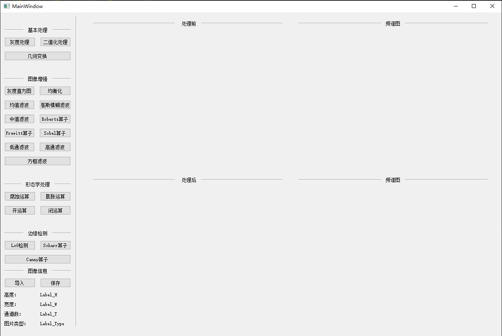

## 功能展示

### 灰度处理

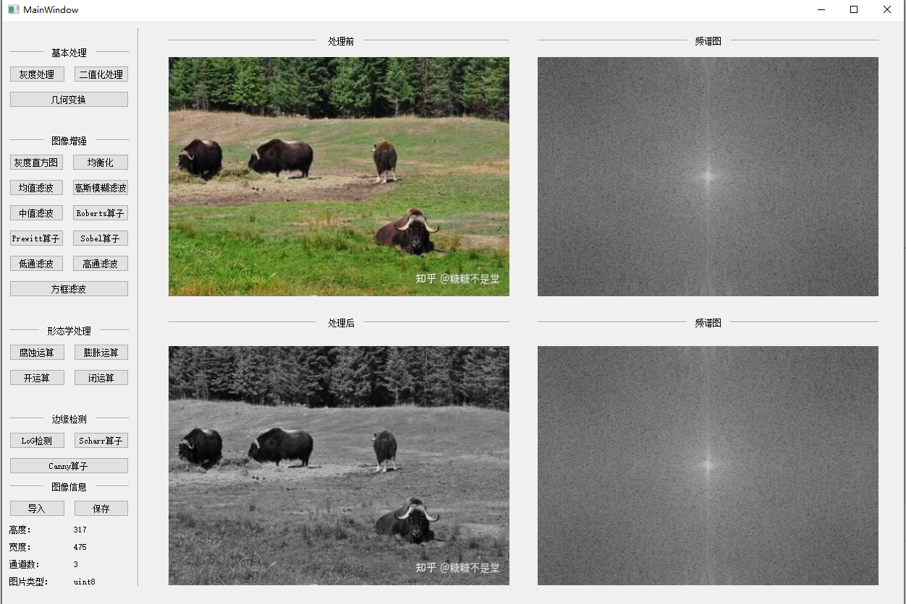

### 二值化

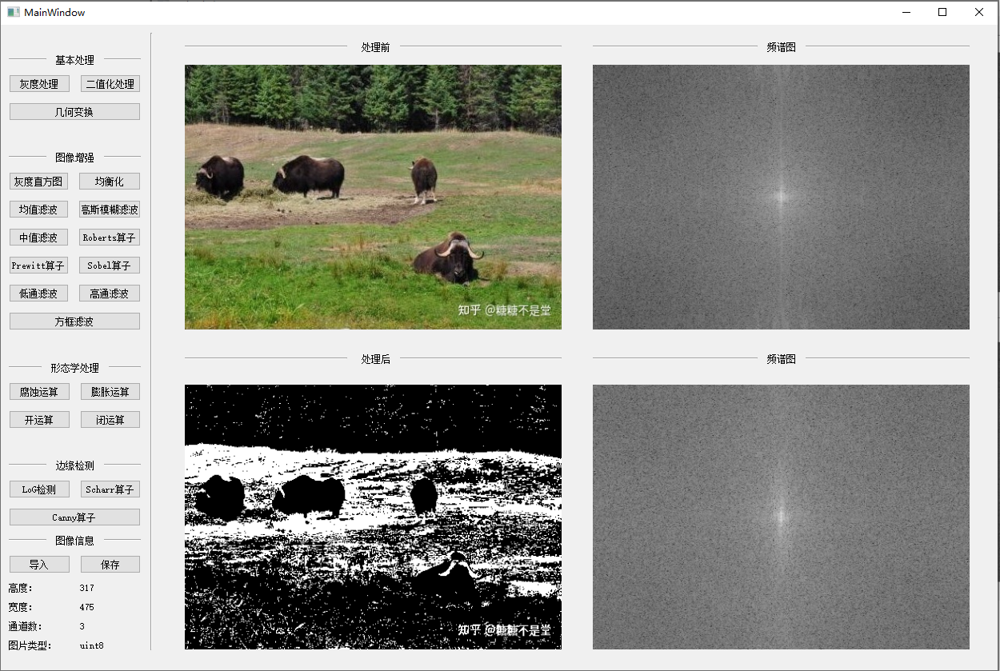

### 均衡化

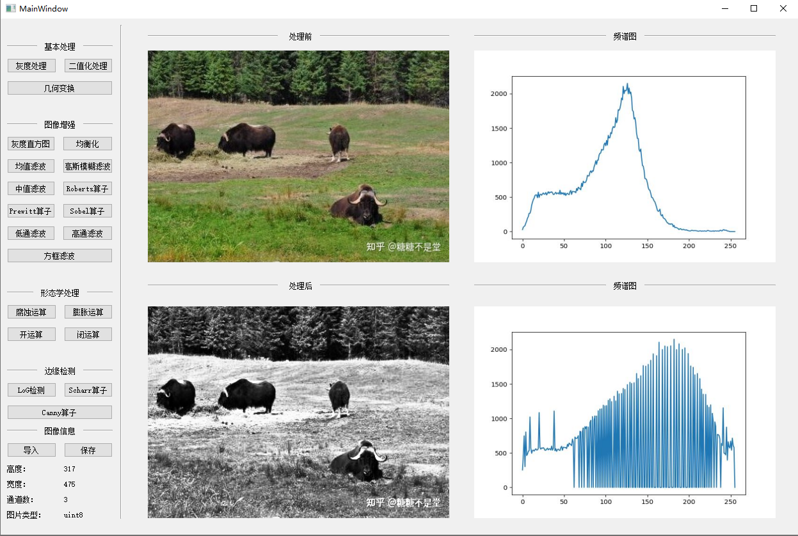

### Roberts算子

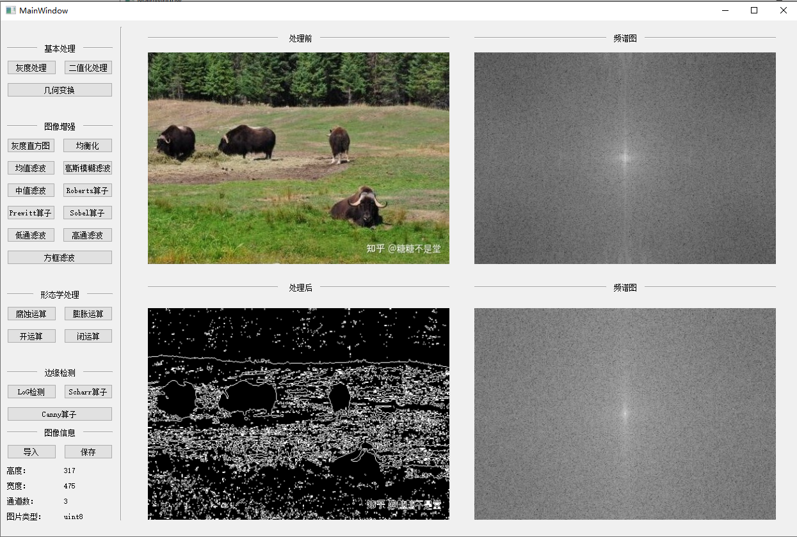

### Prewitt算子

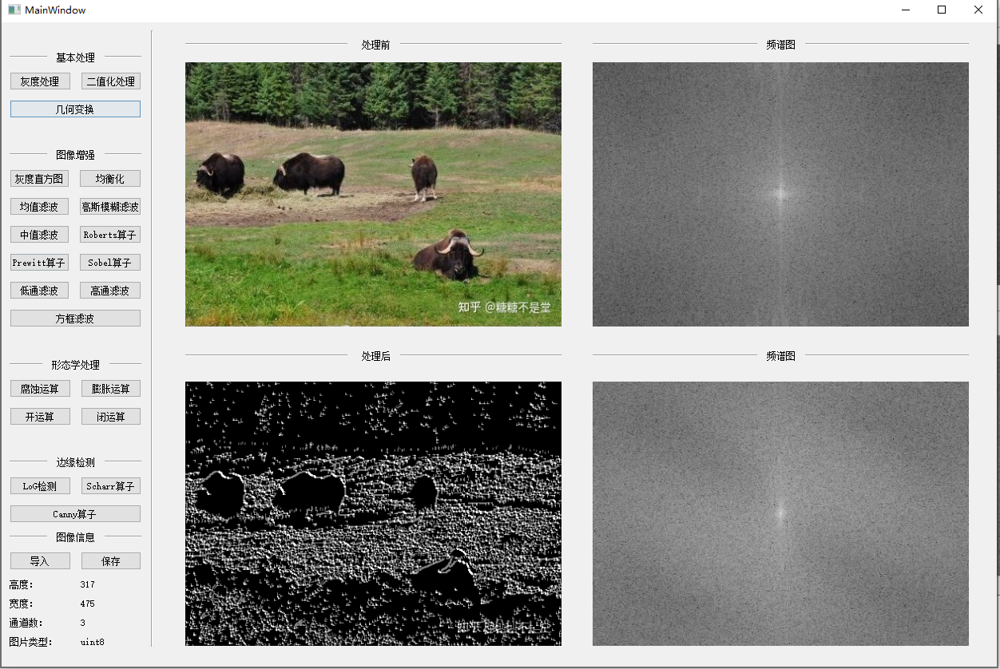

### Sobel算子

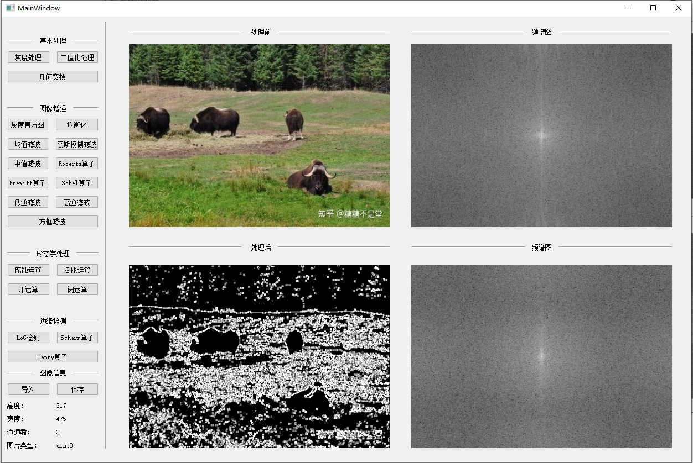

### 腐蚀运算

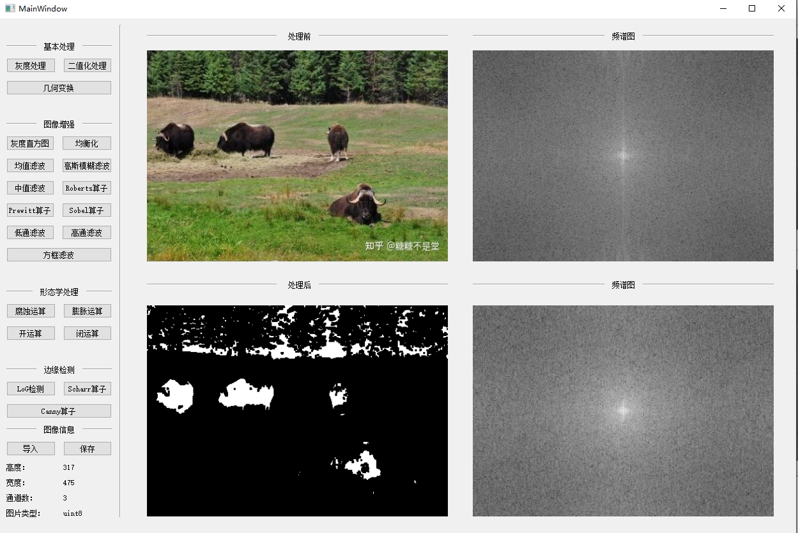

### 膨胀运算

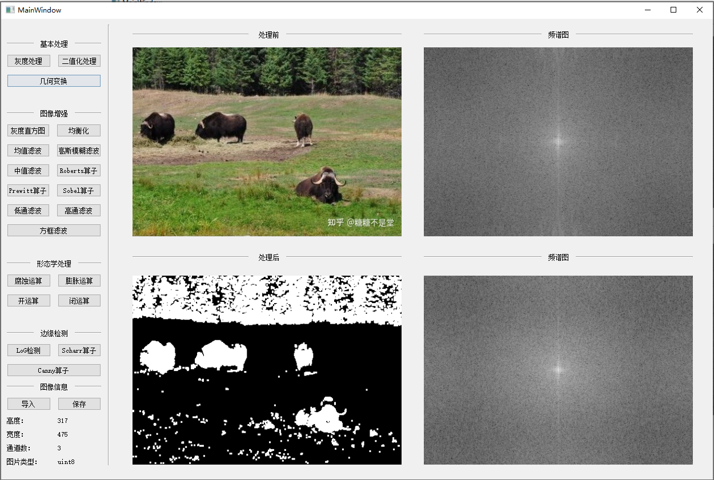

### 开运算

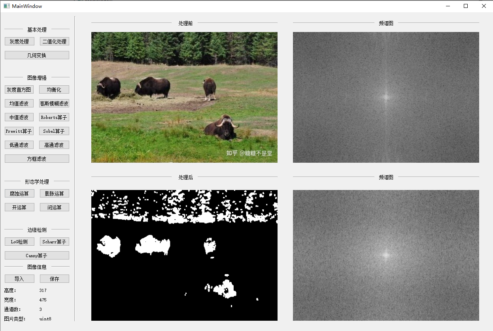

### 闭运算

### LOG检测

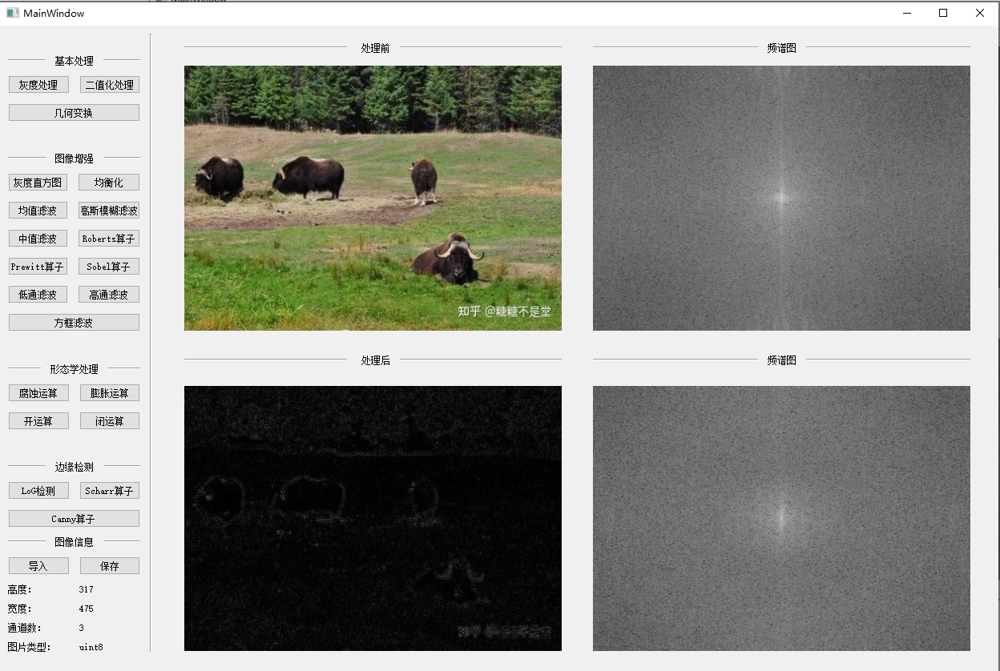

### Scharr算子

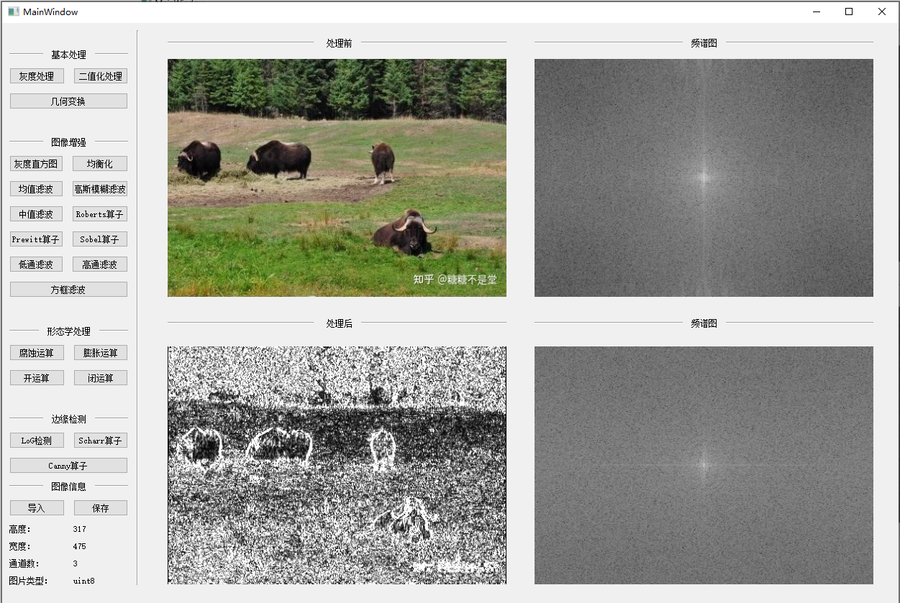

### Canny算子

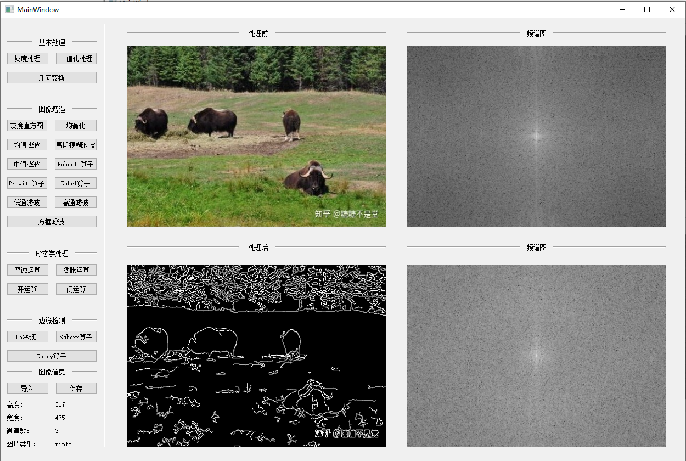

