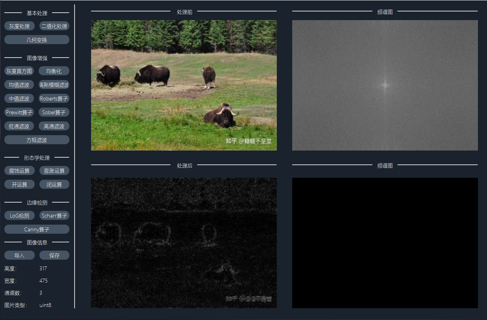

# DigitalImageProcessing
数字图像处理大作业，用来对图像进行简单处理，并在GUI界面上进行显示

## UI界面

## 功能展示

### 灰度处理

### 二值化

### 几何变换

### 均衡化

### 均值滤波

### 高斯模糊滤波

### 中值滤波

### Roberts算子

### Prewitt算子

### Sobel算子

### 低通滤波

### 高通滤波

### 方框滤波

### 腐蚀运算

### 膨胀运算

### 开运算

### 闭运算

### LOG检测

### Scharr算子

### Canny算子

